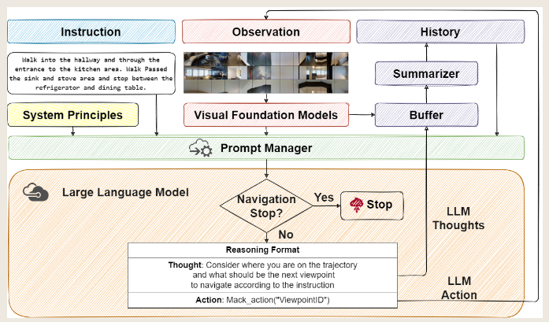
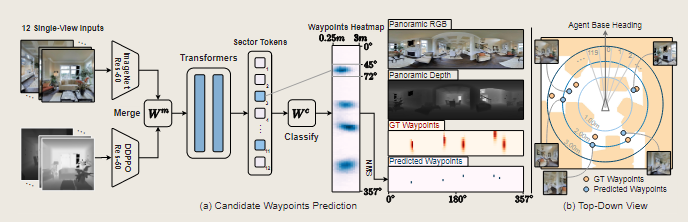

# Reimplement of paper: **NavGPT: Explicit Reasoning in Vision-and-Language Navigation with Large Language Models** to **Continus environment**



## Based Method:
- Predict navigable waypoints on agent position: **Bridging the Gap Between Learning in Discrete and Continuous Environments for Vision-and-Language Navigation**


## environment setup
```bash
conda create -n navgpt python=3.7
conda activate navgpt
pip install -re requirements.txt
```

## run below command to finish one episode:
```bash
export OPENAI_API_KEY=${your openai key}
bash scripts/eval_navgpt.sh ${episode_id}
```